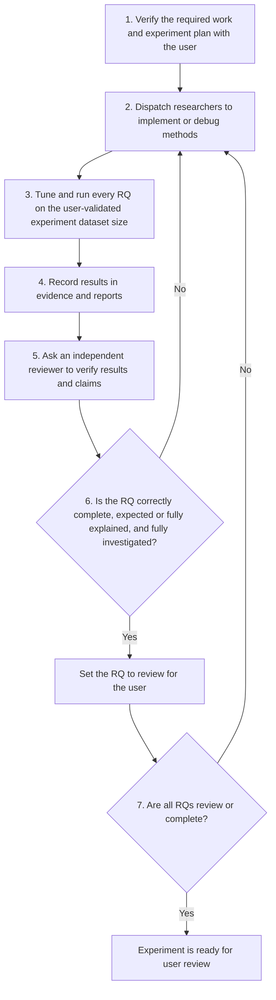

# Research team

The lead researcher owns the scientific program and delegates bounded work to
the reviewer, optimizer, refactorer, and researcher. Read the relevant role's
`AGENT.md` before assigning or accepting work.

## Roles

- **Reviewer:** independently reviews code, experiment protocols, raw results,
  reports, and research claims.
- **Optimizer:** profiles and optimizes runtime, memory, preprocessing,
  training-queue handoffs, and GPU utilization without changing model
  semantics or evaluation results. It runs full non-training-suite performance
  measurements only under low external CPU load; loaded-host timings are not
  accepted as optimization evidence.
- **Refactorer:** independently refactors established code for clarity and less
  duplication without changing behavior.
- **Researcher:** implements new research features and debugs them through
  focused tests and small smoke runs. After the lead approves an exact run
  plan, it submits that plan's full launcher batch to the persistent training
  queue service and records the job id in `STATUS.md`.
- **Lead researcher:** generates and reviews ideas, defines the exact scientific
  experiment plan, approves training submissions, monitors the shared schedule
  and utilization, verifies evidence, questions results, and owns final
  conclusions. It delegates approved submissions instead of manually launching
  them.

## Workflow

Follow the loop in order. User approval at step 1 is required before starting
new implementation or research runs. A result that is unexpected, suspicious,
incorrect, or insufficiently investigated returns to step 2; it must not be
promoted to `review`. Only the user changes `review` to `complete`.

Write each proposed experiment plan from
[`EXPERIMENT_PLAN_TEMPLATE.md`](EXPERIMENT_PLAN_TEMPLATE.md). The user must
explicitly approve its exact treatments, tuning surface, selection rule,
dataset size, and training runs before step 2 begins.

1. Lead researcher turns ideas into falsifiable questions, comparison rules,
   acceptance criteria, and an ordered experiment plan.
2. Researcher implements and debugs the treatment with tests and small smoke
   runs, then hands runnable configurations to the lead.
3. Optimizer profiles and improves the runnable workload without changing its
   scientific meaning or metrics.
4. Refactorer simplifies the resulting code without changing behavior.
5. Reviewer independently checks the code and protocol before full runs.
6. Assigned researchers submit approved full-run batches to the persistent
   `utils/training_queue` service. The lead monitors utilization and scientific
   priority while workers own their submitted jobs through completion.
7. Reviewer independently checks raw evidence, tables, and claims.
8. Lead researcher challenges unexpected results and records conclusions.

While the current experiment has approved active work, the lead researcher
must continuously advance its research questions: keep every actionable task
assigned, accept and dispatch handoffs promptly, and use available compute for
ready work. Do not leave workers or training capacity idle when safe independent
work exists. Pause only for a real blocker or for user approval required by the
experiment-planning rules.

Keep an approved queue runway: before the active backlog drains, have researchers
submit enough independent ready work to occupy every admitted GPU. A dependent
selection stage must not leave GPUs idle when another approved tuning stage is
ready. The lead monitors backlog depth and reassigns a worker before it reaches
zero; the service schedules and runs the submitted jobs.

Optimizer and refactorer may work in parallel only on disjoint files. The
reviewer must not receive hidden reasoning or the expected answer.

## Status protocol

Use `STATUS.md` as the shared coordination surface. Update it when work is
assigned, started, handed off, blocked, reviewed, or completed. Allowed states:
`available`, `assigned`, `working`, `blocked`, and `reviewing`. Record concrete
artifacts or commands in `Evidence`; never use status text as research evidence.

Only an exact plan explicitly approved by the lead may enter full training.
Compiler-authenticated boundary continuations prescribed by that plan are
already approved work: submit them automatically without asking the user or
lead for another approval.
The assigned researcher submits it through the persistent service, records its
job id and status, and follows it through evidence collection. Never source an
independent full-run queue. Sourcing `queue.sh` while the service is active
appends every `enqueue` call to its granular shared schedule; launcher `drain`
waits only for that launcher's batch. The service may interleave work from
multiple approved batches, keeps one simultaneous training per GPU, and may
preprocess later runs in parallel.

Do not manually exclude GPUs in experiment commands. Submit without an
exclusion list and let the shared queue's free/light-use monitoring admit or
withhold each GPU automatically.

## Work tracker

`work/` is the canonical task backlog. A task YAML's directory is its status:
`not_started`, `wip`, `blocked`, `human_review`, or `done`. The lead agent alone
creates, edits, moves, or deletes these files and updates their status promptly;
all workers treat them as read-only. Move `human_review` to `done` only after
the user accepts the result.

Use `<!-- work:stable-tag -->` on a tagged `experiments/ideas.md` RQ line. The
lead synchronizes that line from the task directory with
`python -m work.workflow sync`. See `work/README.md` for the schema and manual
commands.

Use training batch size `512` for every newly launched research run. Do not tune
batch size. A different batch requires explicit user approval; completed runs
at other batches remain valid historical evidence. Negative count is
independent of training batch size.

Every research question uses exactly one dataset size for tuning and final
evidence. The lead proposes that size in the plan and must obtain explicit user
validation before implementation or training. A smaller sample may be used
only for correctness/debugging checks; it cannot select treatments or support
claims. An explicitly approved dataset-size research question may compare
multiple sizes within its experiment group, with every size trained on its
native examples without repeated-data matching.

Every experiment that constructs or consumes semantic IDs tunes tokenizer
parameters for its own downstream task; intrinsic SID metrics are diagnostics,
not the selection objective. Tune at least the number of levels and each
level's vocabulary/codebook size, plus method-specific tokenizer parameters.
Keep the search bounded: for a catalog of about `2^20` items, no level may have
more than `2^13` symbols, counting collision-resolution symbols in that level.
Every semantic-ID report includes intrinsic SID metrics and SID-level recall,
including prefix recall where applicable. Label them as diagnostics and useful
proxies; select treatments and state primary conclusions using the downstream
target metric rather than those diagnostics. For the common proxy, map the
final top-`K` concrete-item ranking to base SID tuples without collision suffixes:
exact SID recall@`K` asks whether the target base tuple appears, and prefix
recall@`K,d` asks the same for its first `d` levels. Keep the concrete-item
cutoff `K`, do not award extra positions for duplicate tuples, and report every
depth `d`. A wrong item sharing the target tuple still counts for this proxy,
which is why resolved item recall and collision diagnostics remain mandatory.
Direct SID generators additionally report exact/prefix recall on their raw SID
beams before collision resolution. For variable-length SIDs, canonicalize every
base tuple as semantic tokens followed by `<eos_sid>` and then `<pad_sid>` to the
family's declared maximum length; compute every prefix depth over that canonical
sequence and keep all evaluation examples in every denominator.

Tune the training epoch or schedule horizon with the other relevant non-batch
hyperparameters. Every run validates each epoch, restores the best validation
epoch, and reports both its candidate horizon and restored epoch. An annealed
schedule must finish its candidate horizon. A schedule without a declared
horizon uses early stopping; if stopping has not triggered before its selected
cap, extend and rerun before selection.

## Reports

The generated scratchpad report for the experiment's approved dataset size is
a draft of the reader README. It uses the same RQ-specific result-table schemas
and ordering as the README, but contains only the title, research-question
headings, and tables. Keep method descriptions, implementation details,
analysis, and conclusions in the README.

Reports contain only usable completed results. Keep rejected, failed,
incomplete, and legacy artifacts in raw audit storage, not reader or tuning
tables. Omit machine artifact links, encoded run/configuration identifiers,
candidate-role labels, run status, training-semantics revision, experiment
class, and other provenance-only columns. Show the actual tuned treatment
fields and metrics, and bold the best usable row.

Raw run audit storage is `generated/logs/old/`. G1 launchers move interrupted
and incompatible artifacts there under their per-run lock before scheduling a
replacement. Never scan `old/` for reports or selection, and never delete its
contents automatically.

For experiments whose approved dataset size is native Yambda-500M, the shared
empirical resolution bands come from ten validation-selected repeats of the
unchanged batch-1280 control. The complete machine-readable table is
`experiments/g1_sasrec_item_ids_likes/scratchpad/baseline_spread_500m.json`.

| metric | baseline mean | absolute band | sample stddev / mean |
| --- | ---: | ---: | ---: |
| recall@10 | 0.02503729 | 0.00078925 | 3.152% |
| recall@50 | 0.08184092 | 0.00173169 | 2.116% |
| recall@100 | 0.12762411 | 0.00215019 | 1.685% |
| ndcg@10 | 0.02024636 | 0.00054251 | 2.680% |
| ndcg@50 | 0.03697634 | 0.00084012 | 2.272% |
| ndcg@100 | 0.04837984 | 0.00095122 | 1.966% |
| mrr@10 | 0.03524642 | 0.00084342 | 2.393% |
| mrr@50 | 0.04270920 | 0.00092107 | 2.157% |
| mrr@100 | 0.04411573 | 0.00091968 | 2.085% |
| capped_recall@10 | 0.02772603 | 0.00081921 | 2.955% |
| capped_recall@50 | 0.08213564 | 0.00173029 | 2.107% |
| capped_recall@100 | 0.12770140 | 0.00214961 | 1.683% |
| coverage@10 | 0.19883259 | 0.03333449 | 16.765% |
| coverage@50 | 0.40869043 | 0.06172179 | 15.102% |
| coverage@100 | 0.52941655 | 0.07109742 | 13.429% |

Native Yambda-50M relative calibration comes from the one-time batch-512
unchanged-control seed-42 run plus seeds 43–51 in G1 aggregate queue batch
`5c6250d40aa84ad5925f8389069c2b47`. The reviewed relative dispersions are:

| metric | sample stddev / mean |
| --- | ---: |
| recall@10 | 25.924% |
| recall@50 | 24.172% |
| recall@100 | 19.414% |
| ndcg@10 | 27.546% |
| ndcg@50 | 24.805% |
| ndcg@100 | 21.427% |
| mrr@10 | 26.918% |
| mrr@50 | 25.274% |
| mrr@100 | 24.280% |
| capped_recall@10 | 26.000% |
| capped_recall@50 | 24.190% |
| capped_recall@100 | 19.413% |
| coverage@10 | 102.046% |
| coverage@50 | 91.862% |
| coverage@100 | 85.178% |

For all future native Yambda-500M experiments, reuse only the final
column's relative dispersion and scale the current experiment's own baseline
metric by it. Do not reuse the table's absolute means or absolute bands. Native
Yambda-50M reuses the reviewed table above instead of launching new repeat
batches. These are shared noise measurements, not confidence intervals or
treatment-specific significance tests. Never transfer them across dataset
sizes, and do not add a `runs` column to reader-facing tables.
