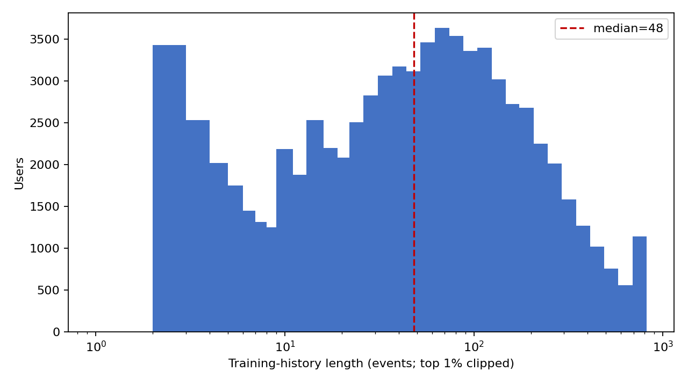

# G1 training-history length distribution

Source: `generated/datasets/yambda/500m_like_core5_knownitems/events.parquet` (all training-eligible users); the final 7 days are excluded.

Median training-history length: **48 events**.

Users: 75,725.

| percentile | p25 | p50 | p75 | p90 | p95 | p99 |
| --- | ---: | ---: | ---: | ---: | ---: | ---: |
| events | 14 | 48 | 124 | 262 | 392 | 819 |

Reproduce from the repository root:

```bash
python experiments/g1_sasrec_item_ids_likes/analysis/sequence_length_distribution.py
```


